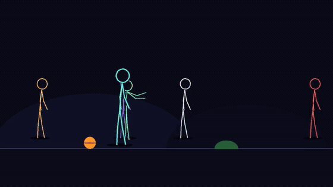
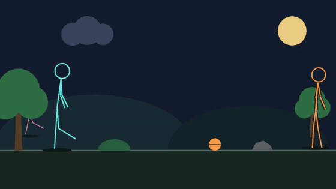

# 2DVideoGen

**A 60M-parameter model that writes animation scripts, and a renderer that turns them into video — trained and run entirely on one laptop.**

Twenty-three logged attempts at small-scale 2D animation generation on a single 8 GB consumer GPU with a damaged cooling fan, so every GPU run is capped at ~50% duty. Roughly half the attempts failed. The failures are logged with their real causes in [`ATTEMPTS.md`](ATTEMPTS.md), because they carry more transferable information than the successes.

---

## What it produces

**Six characters, script written by the model.** The prompt was natural language; the model emitted the scene script; nothing was hand-authored. Highest motion coverage in the project (6.82%).



**Three characters, seven props, hand-written script.** The best-looking clip in the project, and still the one a human wrote. Warp error 0.0055 against a 0.06 pass bar.



**The first end-to-end generation.** From the unseen prompt *"two friends meet in the park, one waves, then they kick a ball around"* — emitted with zero repairs, rendered, and scored USABLE with no human in the loop.


Full-resolution: [`out/a23_six.mp4`](out/a23_six.mp4) · [`out/a21_park.mp4`](out/a21_park.mp4) · [`out/a22_generated.mp4`](out/a22_generated.mp4)

---

## The pipeline

```
natural language  →  t5-small (60M, CPU)  →  scene-script DSL  →  compositor  →  .mp4  →  critic verdict
                     model/scene_infer.py    scenes/*.scene       scenescript.py         critic/evaluate.py
```

No GPU is used anywhere in this path. Training the shipped script writer takes **548 seconds on CPU**.

## Quickstart

```bash
# 1. Generate a scene script from a prompt, then render it
USE_TF=0 python model/scene_infer.py "two friends meet in the park, one waves, then they kick a ball around" \
    --ckpt model/checkpoints/v3-staged --sample --unique-colours -o scenes/mine.scene

python scenescript.py scenes/mine.scene -o out/mine.mp4 --frames out/mine_frames

# 2. Score it honestly
USE_TF=0 python critic/evaluate.py out/mine_frames --max-frames 24

# 3. Render a hand-written reference for comparison
python scenescript.py scenes/park_meet.scene -o out/park.mp4 --frames out/park_frames
```

`--sample` matters: beam search collapses staging (see below). Model weights are not in the repository — see [`model/MODELS.md`](model/MODELS.md) for what each checkpoint was trained on and how to reproduce it.

## Results

All figures below are for the shipped checkpoint, `v3-staged` — t5-small, 60M
parameters, 6 epochs, **548 s on CPU**. Earlier checkpoints and their numbers
are in [`model/MODELS.md`](model/MODELS.md).

| | value |
|---|---|
| Parse / render rate, unseen prompts | 100% / 100% |
| Duplicate-colour violations | 0 / 150 (was 71 / 150) |
| Cast size 6–8 read correctly | 15 / 15 |
| Critic pass rate, generated clips | 9 / 10 |

**Decoding is a real trade, not a free win.** The same weights behave differently
depending on how you decode, and neither setting dominates:

| | beam search | sampling (+ rerank) |
|---|---|---|
| Prompt match, in-distribution | **85.7%** | 13–20 pts lower |
| Prompt match, out-of-distribution | 70.8% | **75.0%** |
| Staging score | 0.182 | **0.862** |

Sampling is the default here because staging is what makes a clip watchable. Use
beam search if you care more about obeying the prompt literally.

## Three findings

**Objectives interfere rather than compound.** Adding a temporal mechanism cut flicker 36.2× → 25.0×, the first real reduction in the project — and simultaneously dropped pose obedience from 1-of-4 frames to 0-of-8. The anime proportions that make a character look right (ear span 1.65× shoulder width, against 0.52 for a human) are the same ones that push the pose guide off ControlNet's conditioning manifold.

**A model can look incapable when its data never asked.** The script writer appeared unable to count a cast. A controlled probe found it was reading *clause count*, not numerals — because clause count equalled cast size in 5,681 of 5,688 training examples. Deconfounding the synthesis cut the generalisation gap from 65.7 to 23.5 points.

**An apparent model defect can be a decoding artefact.** Generated casts stacked on top of each other, and this was recorded as the model failing to learn staging. It was beam search reporting the mode of a distribution that was already fine. Same weights, sampling instead: staging 0.188 → 0.862, distinct positions across 30 scenes 3 → 55.

## What is not solved

- **The models still do not beat the hand-written script on richness.** A generated scene stages better than the weaker hand-written reference, but has fewer characters, fewer events and less happening.
- **Cast size saturates around 9.** The wall moved from 6; it was relocated, not removed, consistent with known limits of small sequence models.
- **Sampling is not free** — the staging gain costs about 13 points of action fidelity, and reranking does not recover it.
- **Spatial language fails.** Supervising "on the left", "facing each other" and similar gave ~2.7 points over a mismatched-pair control, and negative under sampling. A stated prediction, falsified.
- **Styled anime output is out of reach** at this hardware budget. That route is closed by measurement, not by opinion.
- **No user study and no baseline comparison against another system.** Both are real gaps.

## Repository

| path | what it is |
|---|---|
| [`ATTEMPTS.md`](ATTEMPTS.md) | The primary source. All 23 attempts, with failures and retractions. Start here. |
| [`paper/PAPER.md`](paper/PAPER.md) | The written-up paper. |
| [`paper/RESEARCH.md`](paper/RESEARCH.md) · [`RESEARCH2.md`](paper/RESEARCH2.md) | Literature surveys, with hardware costs and what was ruled out. |
| [`critic/README.md`](critic/README.md) | The evaluation harness: 8 metrics, thresholds, and the reason for each. |
| [`model/MODELS.md`](model/MODELS.md) | Checkpoint provenance: data, command, runtime, measured rates. |
| `scenescript.py` | Scene compositor — cast, timeline, props, occlusion. CPU only. |
| `model/` | Script-writing model: grammar, synthesis, training, inference, probes. |
| `critic/` | The evaluator. Independently reproduced a logged 23.6× flicker figure as 23.59×. |
| `scenes/` | Scene scripts, hand-written and generated. |

## A note on the evaluator

Four separate times, a metric or a decoding choice produced a confident wrong answer: perceptual similarity scored known-bad blobs *above* a correct control; a single stochastic detection compared against a different crop basis cost a clip its verdict, twice; pose estimators return *no person* on every stick figure this project produces, including the known-good ones; and beam search was mistaken for a model defect. Each was caught and documented. That list is the most transferable thing here.

## Requirements

Python 3, PyTorch, `transformers`, `opencv-python`, `numpy`, `Pillow`, `ffmpeg` on PATH. Set `USE_TF=0` before anything that imports `transformers` — otherwise 4.57 tries a Keras 3 backend and dies.

GPU work is optional and routed through `tools/gpuguard.py`, which duty-cycles to ~50% and holds at a temperature ceiling. The fan on the development machine is damaged; the guard is why the experiments were possible at all.
