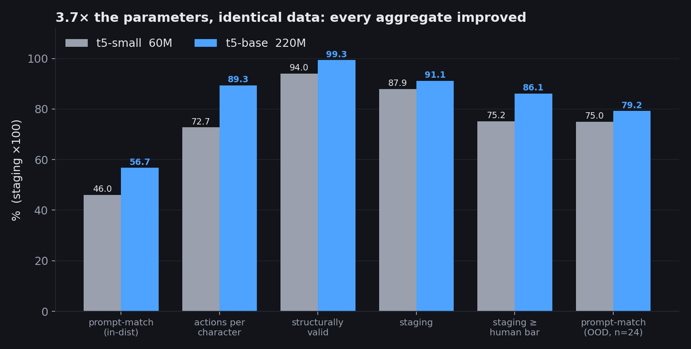
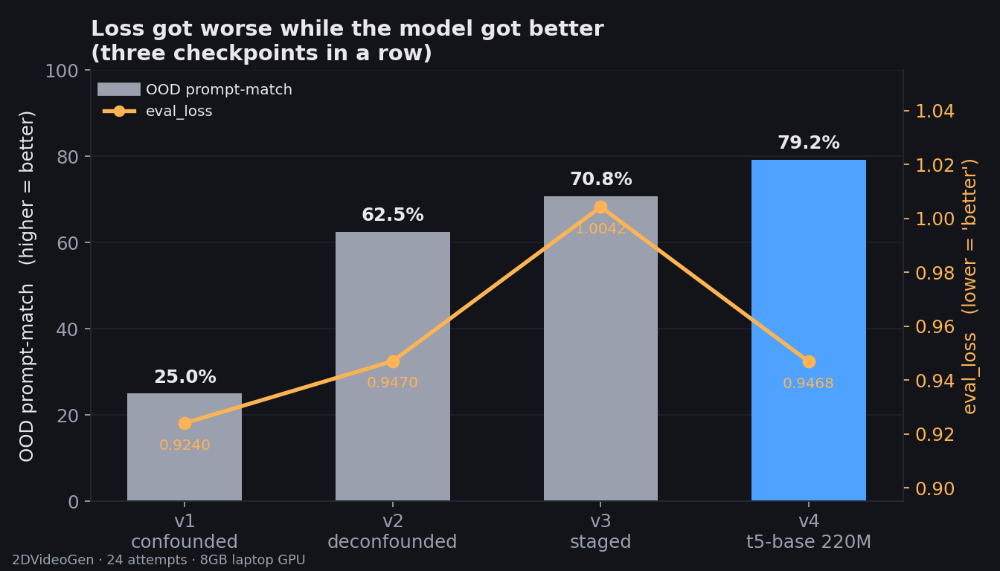

# Parameters or Data? What Actually Moved a Small 2D Animation Model

**Sahilpreet Singh Sidhu** · 2DVideoGen · September 2026

---

## Abstract

This note isolates two levers across the 2DVideoGen project: **the number of parameters** and **the
training data**. Each was changed while the other was held fixed, on one 8 GB consumer laptop GPU
(RTX 4060, thermally capped at 50% duty). Five controlled comparisons are reported.

1. In the vector-animation route, a **smaller model with about 7x the animation data** (Qwen3-1.7B)
   beat a **larger model with less** (Qwen3-8B). Valid output went from 94% to 100% and training loss from 0.435 to 0.271.
2. In the scene-script route, **three dataset revisions at a fixed 60M parameters** cut the
   out-of-distribution generalisation gap from **65.7 to 15.0 points**. Out-of-distribution
   prompt-match rose from **25.0% to 70.8%**.
3. **3.7x the parameters on byte-identical data** (60M to 220M) raised every aggregate metric, by
   +10.7 points in-distribution and +4.2 out-of-distribution. It did **not** produce a better
   video: the critic scored both clips USABLE, and a human cannot tell them apart.

The conclusion is narrow and measured: on this task and this hardware, **what the data asked the
model to do mattered more than how big the model was.** Extra capacity bought polish, meaning
structural validity and action fidelity. It did not buy a better result.

---

## 1. Setup

Two model families were trained, on two different output formats.

| route | output | models | hardware |
|---|---|---|---|
| Vector animation (Attempts 14-15) | AniSVG frame sequences (vertex coordinates per frame) | Qwen3-8B (LoRA, streamed), Qwen3-1.7B (LoRA, resident) | 8 GB RTX 4060 Laptop |
| Scene scripts (Attempts 22-24) | a symbolic scene DSL, rendered to video on CPU | T5-small (60M), T5-base (222.9M) | CPU for 60M; GPU with gradient checkpointing for 220M |

Every scene-script model used the same training harness (`model/train.py`), the same 6 epochs, the
same effective batch of 16 and the same learning rate of 3e-4. Each experiment below changes
exactly one thing.

**Metrics.** *Prompt-match* is the share of prompts where every fact stated in the prompt (cast
size, background, actions, ball interaction) appears in the generated script. It is measured
in-distribution on 150 held-out validation prompts and out-of-distribution on 24 hand-written
prompts. *Valid, no repair* is the share of scripts that parse and render with zero problems.
*Staging* is a calibrated layout score where the two hand-written reference scenes average 0.912.
Rendered clips are scored by an automatic critic (warp error, motion coverage, identity).

---

## 2. Experiment A: a bigger model against more data (vector animation)

The corpus was 91,387 animation clips, packed to 78,971 train/val clips and 198.3M tokens. The two
runs trade parameters against how much animation signal each model saw.

| | **v1: Qwen3-8B** (streamed, 1024 ctx) | **v2: Qwen3-1.7B** (resident, 4096 ctx) |
|---|--:|--:|
| parameters | 8B | **1.7B** (4.7x smaller) |
| clips seen | 28,034 | **77,397** |
| frames per clip | ~10 | **~25** |
| wall clock | 29.8 h | 64.2 h |
| final train loss | 0.4349 | **0.2709** |
| valid generations | 94% | **100%** |
| colour and object count | rarely right | **usually right** |
| recognisable geometry | no | no |

**Result.** The model with 4.7x fewer parameters and about 7x the signal won on every measure that
moved. Given "two four-pointed stars, a larger purple and a smaller pink", v2 emitted two shapes
with the right colours, the right count and the right relative size.

**What neither lever fixed.** Neither model drew a recognisable star. Colour and structure are
short, repetitive, low-entropy tokens, and they were learned. Vertex coordinates are long runs of
exact integers where one wrong digit deforms the shape, and they were not. More data moved colour
a lot and geometry almost not at all. Neither size nor data can close that gap, because it is a
property of regressing coordinates through next-token prediction. That finding moved the project
to a symbolic output format.

**Also measured.** The 8 GB card was never bound by parameter count. Every large configuration
failed on the same 1.05 GiB allocation, because the loss upcasts logits over a 151,936-token
vocabulary to fp32. Computing the loss in slices cut peak VRAM from 4.92 to 3.16 GB at 0.6B, with
an identical objective (0.8340 on a fixed batch under all three implementations).

---

## 3. Experiment B: changing only the data, at 60M parameters

Three T5-small (60M) models, identical except for the training data. Every dataset has 6,000
training rows and 700 validation rows.

| version | what changed in the data | in-dist prompt-match | out-of-dist prompt-match | gap |
|---|---|--:|--:|--:|
| `v1-confounded` | baseline synthetic prompts | **90.7%** | 25.0% | 65.7 pts |
| `v2-deconfounded` | cast size stated independently of clause count | 86.0% | 62.5% | 23.5 pts |
| `v3-staged` | + staging targets, cast range extended to 8 | 85.8% | **70.8%** | **15.0 pts** |

**The defect in v1's data.** In `scene_train.jsonl`, the number of clauses equalled the cast size
in **5,681 of 5,688** examples (99.9%). The model appeared unable to count characters. A controlled
probe showed it was counting clauses: its emitted cast size equalled the clause count, not the
stated numeral, in **15 of 15** trials. The data had never asked it to do anything else.

**The fix.** `--deconfound` states the count while describing only a random subset of the cast,
which cuts that co-occurrence from 99.9% to 68.0%. Same model and same hyperparameters, trained
on CPU (v1 took 530 s):

- out-of-distribution prompt-match: **25.0% to 62.5%**, then to **70.8%** with v3
- the gap between in- and out-of-distribution: **65.7 to 23.5 to 15.0 points**
- the cost: about 4-5 points in-distribution, because the easy shortcut is gone

**Result.** Three data revisions, with zero added parameters, raised out-of-distribution accuracy by
**45.8 points**.

---

## 4. Experiment C: changing only the parameters, on identical data

`v4-base` is T5-base (222.9M, 3.7x) trained on the **byte-identical** v3 dataset with the same
epochs, effective batch and learning rate. The only change needed to fit it on the 8 GB card was
gradient checkpointing with batch 4 x accumulation 4, which leaves the optimisation identical.

Scores are for the shipped decoding configuration (sampling + rerank 4):

| | **v3: 60M** | **v4: 220M** | change |
|---|--:|--:|--:|
| in-distribution, every stated field | 46.0% | **56.7%** | +10.7 |
| actions per character | 72.7% | **89.3%** | +16.6 |
| valid, zero problems, no repair | 94.0% | **99.3%** | +5.3 |
| staging | 0.879 | **0.911** | +0.032 |
| out-of-distribution, every stated field (n=24) | 75.0% | **79.2%** | +4.2 (one prompt) |
| out-of-distribution action recall | **94.8%** | 94.0% | -0.8 |
| final eval_loss | 1.0042 | **0.9468** | |

**The rendered result.** Both models were given the same six-character prompt, seed and flags:

| | v3 60M | v4 220M |
|---|--:|--:|
| critic verdict | USABLE | USABLE |
| warp error (lower is smoother) | 0.0077 | **0.0064** |
| motion coverage | **6.82%** | 5.92% |
| timeline events | **16** | 14 |

**Result.** Capacity improved every aggregate and produced a clip a human cannot tell apart from
the smaller model's. The failure moved rather than disappeared: v3 stacks three characters in the
centre, and v4 stacks two and loses one off the right edge.

**What capacity did buy:**

- **Near-perfect structural validity** (99.3%).
- **The end of a trade-off earlier recorded as permanent.** At 60M, sampling cost 13-20 points of
  action fidelity against beam search. At 220M, sampling scores 89.3% on actions, which is higher
  than the 60M model under beam search (85.7%).
- **Staging under beam search.** It rose from 0.182 to 0.689, which falsified this project's own
  prediction that beam-search collapse was purely a decoding property.

**What it did not buy:** following spatial instructions. `layout` (for example "leftmost") fell from
45.8% to 29.3% under beam search and barely moved under sampling (36.4% to 38.4%).

---

## 5. Why the loss curve misled

Across v1 to v3, **eval_loss rose while out-of-distribution accuracy rose with it**. Each dataset
was harder and higher-entropy than the last, so a higher loss meant a harder test, not a worse
model. eval_loss fell only at v4, the one step that changed the model instead of the data. A
project that selected checkpoints by loss would have kept v1, the model that could not count.

---

## 6. Side by side

| lever | change | parameters | out-of-dist effect | better output? |
|---|---|--:|---|---|
| data volume (A) | about 7x the signal, with a 4.7x smaller model | 8B to 1.7B | valid 94% to 100%; colour and count fixed | **yes** |
| data content (B) | remove one confound | 60M (fixed) | 25.0% to 62.5% | **yes** |
| data content (B) | add staging targets, extend cast range | 60M (fixed) | 62.5% to 70.8% | **yes** |
| parameters (C) | 3.7x the model, identical data | 60M to 220M | 75.0% to 79.2% | **no, a tie** |

---

## 7. Conclusions

1. **Data design beat model size.** Every step that produced a visibly better result changed the
   data. The one step that changed only the parameters improved the numbers and left the video
   the same.
2. **A small model can look incapable when its data never asked for the skill.** The model looked
   unable to count until one confound was removed. Check with a controlled probe before scaling up.
3. **Scale buys reliability, not direction.** More parameters made output valid more often and
   removed a decoding trade-off. They did not make the model follow spatial instructions.
4. **Loss is not the metric.** On a sequence of increasingly hard datasets, a rising eval_loss
   accompanied a better model.

### Limitations

The out-of-distribution set has 24 prompts, so one prompt is 4.2 points. The 60M and 220M
comparison is a single run per size. Experiment A changes context length and data volume together,
so it separates parameters from signal but not signal from context. All data in Experiments B and C
is synthetic.

### Reproducing

Datasets: `DATASETS.md`. Checkpoints and exact training commands: `model/MODELS.md`. Full logs of
every attempt, failures included: `ATTEMPTS.md` (Attempts 14-15 and 22-24).
